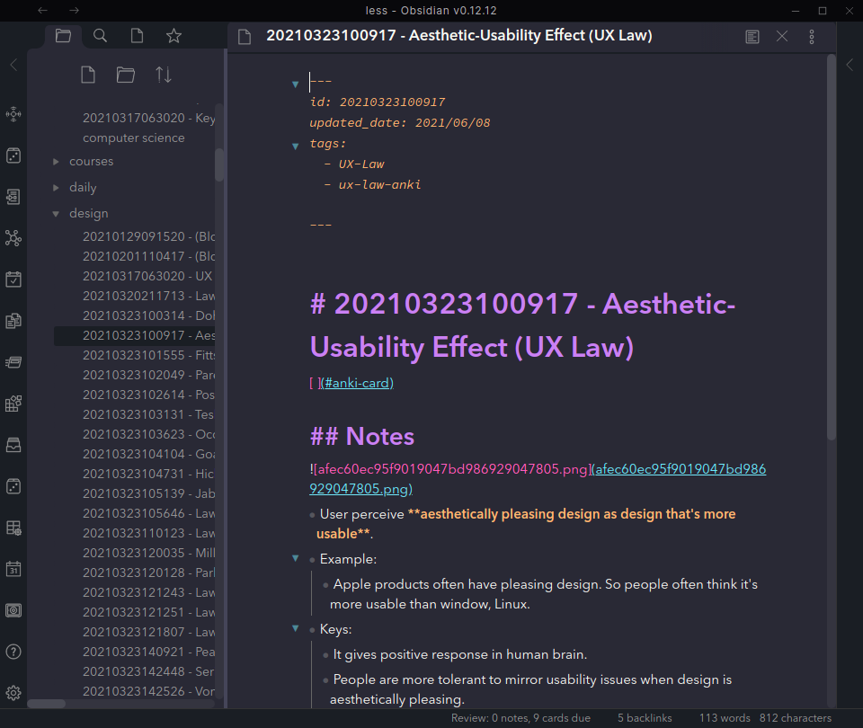
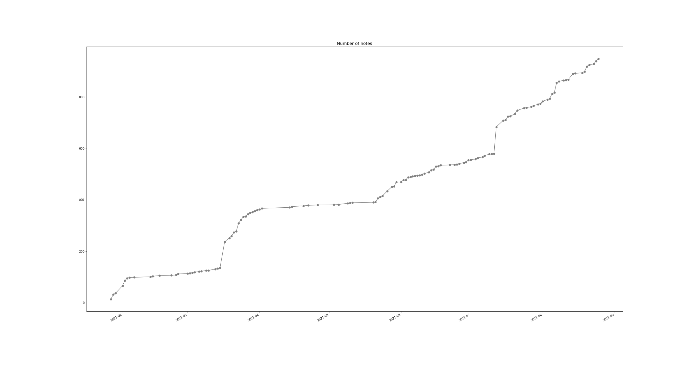
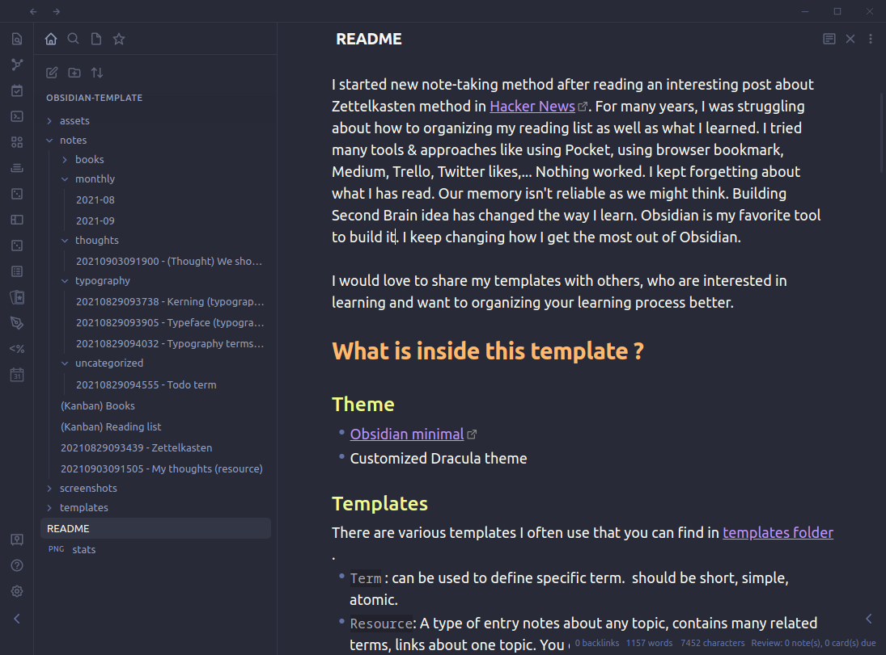
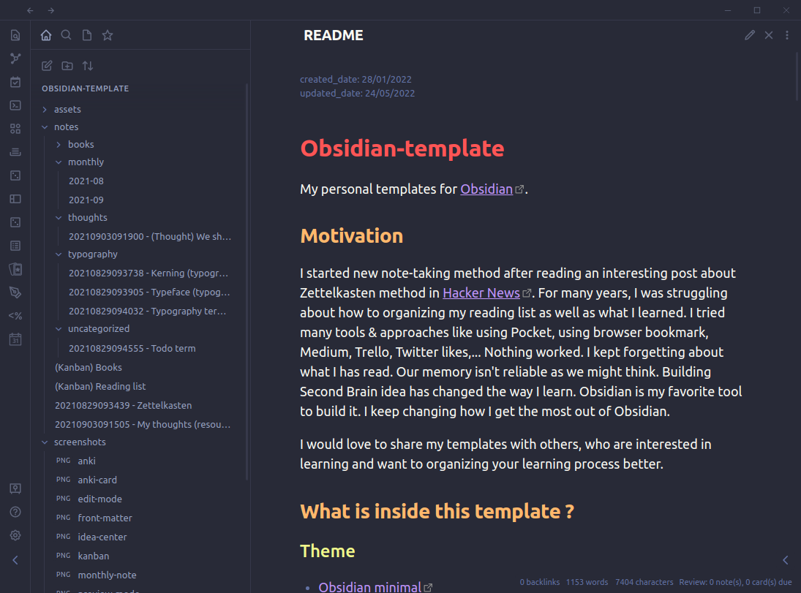
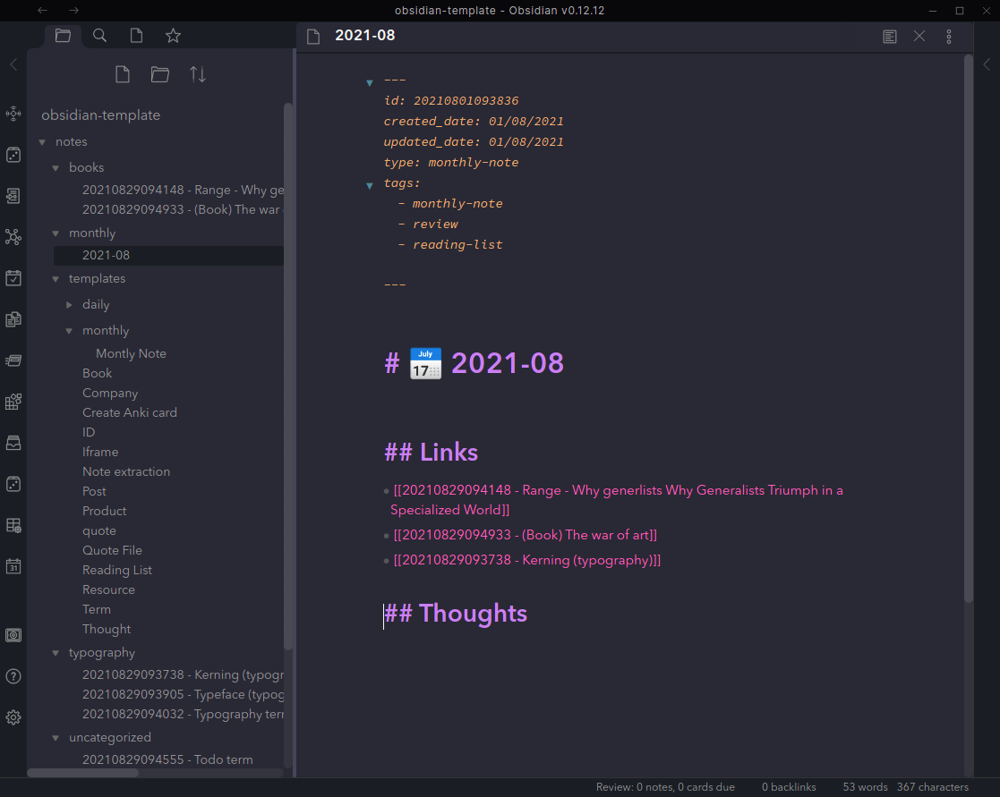
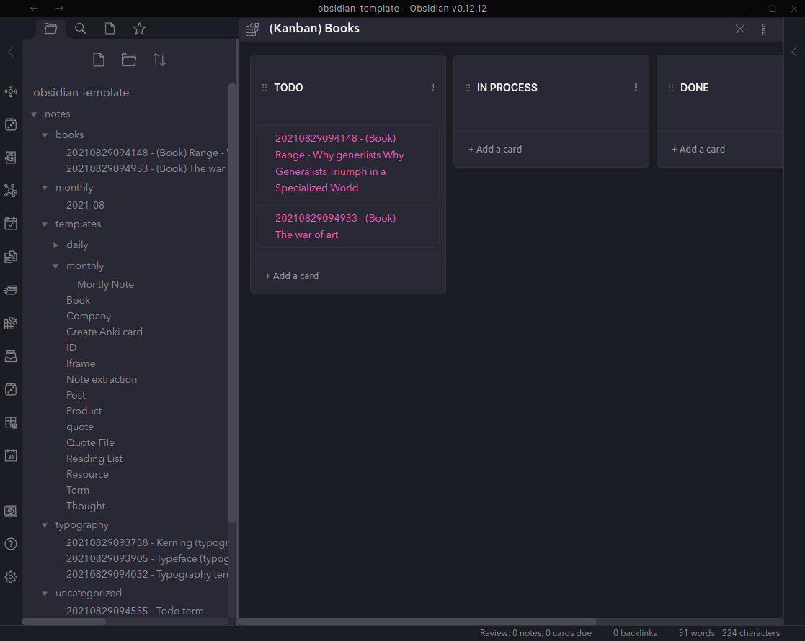

# Obsidian-template
My personal templates for  [Obsidian](https://obsidian.md).
## Motivation

I started new note-taking method after reading an interesting post about Zettelkasten method in [Hacker News](https://news.ycombinator.com/item?id=25803132). For many years, I was struggling about how to organizing my reading list as well as what I learned. I tried many tools & approaches like using Pocket, using browser bookmark, Medium, Trello, Twitter likes,... Nothing worked. I kept forgetting about it. Our memory isn't reliable as we might think. Building Second Brain idea has changed the way I learn. Obsidian is my favorite tool to build it. I keep changing how I get the most out of Obsidian.

I would love to share my templates with others, who are interested in learning and want to organizing your learning process better. 
## What is inside the template ?
### Theme
I creates modified version of Dracula theme. It has better line-spacing between heading and content, better front matter styling, better font-scale so you can have better writing experience.
Here is the screenshot of the main screen:


I think [Typora like editor](https://trello.com/c/pXHHXIzj/18-wysiwyg-editor-like-typora) would be better, but it's for the future :). 
### Templates
There are various templates I often use that you can find in [templates folder](notes/templates).
- `Term` : can be used to define specific term.  should be short, simple, atomic.
- `Resource`: A type of entry notes about any topic, contains many related terms, links about one topic. You can use this as an entry points to explore other concepts in a topic.
- `Quote File`: Quote said by famous people.
- `Create Anki Card`: Used to mark a card as anki card. See more details in section bellow.
- `ID`: Generate unique Zettelkasten ID for current note.
- `Book`: Summary about a book.
- `Thought`: used to capture my ideas.
- ...
### Extensions
I use some extensions, some are public extensions, some are mine, some are modified by me based on the original obsidian plugins.

- [Dual](https://github.com/Psionica/dual-obsidian-client): A skilled virtual assistant for Obsidian.
- [Emoji Shortcodes](https://github.com/phibr0/obsidian-emoji-shortcodes) and [Emoji Toolbar](https://github.com/oliveryh/obsidian-emoji-toolbar): to add new icon to your notes.
- [Kanban](https://github.com/mgmeyers/obsidian-kanban): To manage your reading list.
- [Spaced Repetition](https://github.com/st3v3nmw/obsidian-spaced-repetition): to create anki cards .
- [Monthly review](https://github.com/tuan3w/monthly-review-obsidian): To link your notes to monthly note.
- Markdown prettifier (modified):  Fix and reformat your markdown notes, keep it clean, add modified date to your notes.
- [Smart Random Note](https://github.com/erichalldev/obsidian-smart-random-note) : Random visit notes from your search result.
- [Tag Wrangler](https://github.com/pjeby/tag-wrangler): rename, merge, search tags from Obsidian tag pane.
### Taking notes tips
1. Creating notes
- Create new Zettelkasten notes when you want to take note about new thing by hot key `Ctrl+Shift+N` and pick a template by using hot key `Ctrl+T`
- Reformat your note after edit: `Ctrl+Alt+L`
- Create new refer link to monthly note for later review: `Ctrl+Shift+L`.
- For books, you might want to add [link to local file](https://forum.obsidian.md/t/how-to-link-a-local-file-in-obsidian/5815) so that you can open book from your note quickly.
- If you want to add content later,  just add a `todo` tag in the front matter. 
2. Review a topic/notes
- Notes are organized by topics. Open search and search for tag you want to review. Press `Ctrl+Tab` to view random from search result. 
- Every month, a monthly note is created under `notes/monthly` folder. You can review list of notes linked to it.
- Any new note should add a `review` tag and remove it as soon as you think it's good enough. To visit a note that need to be reviewed, enter `Ctrl+R` or exec command `Spaced Repetition: Open a note for review`.
3. Track your reading
- I created two Kanban boards to track my regular reading and book reading. I think it really helps when you have multiple things in your reading list.  Again, don't trust your memory.
4. Naming file
- One tip I regularly find useful is adding type of notes in the file name to make them clear, so you can navigate file later easier. For example:
	- Resource notes: `(Resource) Topic name`
	- Kanban board: `(Kanban) Books`
	- Book: `(Book) product`
5. Anki card
- Overtime, you will create new cluster of knowledge. You might want to review this topic using  better way than visiting them randomly. So [Anki is your friend].(https://aliabdaal.com/spaced-repetition/) . Creating new anki deck is simple enough:
	- Add new desk: Add tag about topic in [Spaced repetition plugin setting](https://github.com/st3v3nmw/obsidian-spaced-repetition). I prefer this approach more than turning folder name into deck name because it provides more better control.
	- Add new card: I only used [multiple-line card style](https://github.com/st3v3nmw/obsidian-spaced-repetition/wiki/Flashcard-Types#multi-line-basic) . I choose  `[ ](#anki-card)`  as separator because it's invisible in preview mode.  To add separator, just use template `Create Anki Card` to insert the separator after the first heading of the note. By default, `Term` card is an anki card. 
6. Virtual Assistant
I do explore [Dual assistant plugin](https://github.com/Psionica/dual-obsidian-client). I love the works by Paul Bricman. AI assistants will be an powerful tool to support us to exploring ideas in our modern world. Just follow the guide if you want to try it.
7. Hot keys
 I use a number of hot keys to make quick actions. You can see them in `Hotkeys` section in the setting. 
### Stats tracking (optional)
 I also provide some [script](./update_stats.py) to update your reading stats (how many notes you have taken over time). Everytime you want to update git, just run command:
 ```bash
 $ ./update your message without quote here
 ```
 
 It will add all the new notes, update note stats, generate a picture of your progress and create new commit with your message. Your stats will look like this:
 
### Screenshots
- Edit mode:

- Preview mode:

- Front matter:

- Monthly note:

- Kanban board:

## FAQs
If you wanted to know more about Zettelkasten method, I recommend book [How to Take Smart Notes: One Simple Technique to Boost Writing, Learning and Thinking – for Students, Academics and Nonfiction Book Writers](https://www.amazon.com/gp/product/1542866502/) as a good start.

Happy learning :) .
## License
[MIT](LICENSE)
